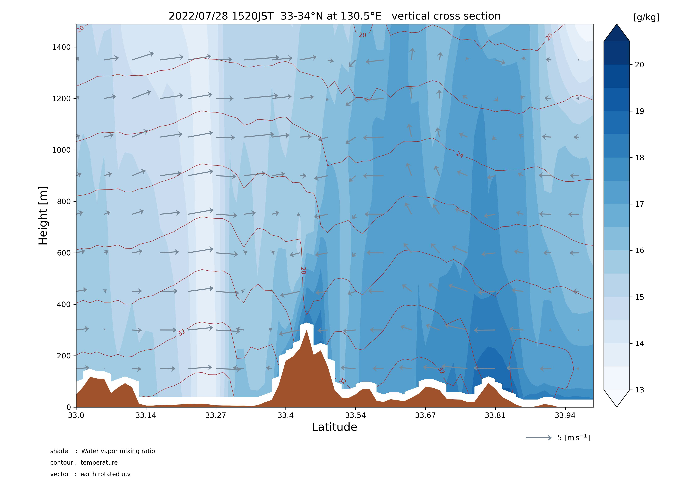
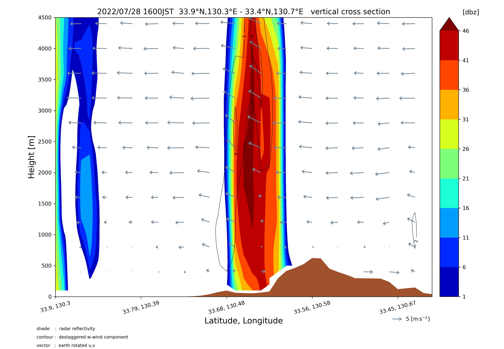

# WRF Vertical Drawing

領域気象モデルWRFのシミュレーション結果を描画します。





## 仮想環境

```bash
# via anaconda
conda env create -f requirements.yml
conda activate wrf
```

## Usage

1. `data/wrfout`下にシミュレーション結果のnetcdfファイルを配置

   ```bash
   cd path/to/this/root_dir
   mkdir -p data/wrfout
   cp /path/to/your_wrfout_file.nc data/wrfout
   ```

2. `src/constants/configuration.py`で描画範囲等を設定

3. `src/main.py`を実行して、画像やGifを作成

   ```bash
   python src/main.py
   ```

作成された画像は `img`下に出力されます。

## Note

   描画変数名は、`data/information`下に出力されるテキストファイル及び
   [公式ドキュメント](https://wrf-python.readthedocs.io/en/latest/user_api/generated/wrf.getvar.html#wrf.getvar)を参照してください。
