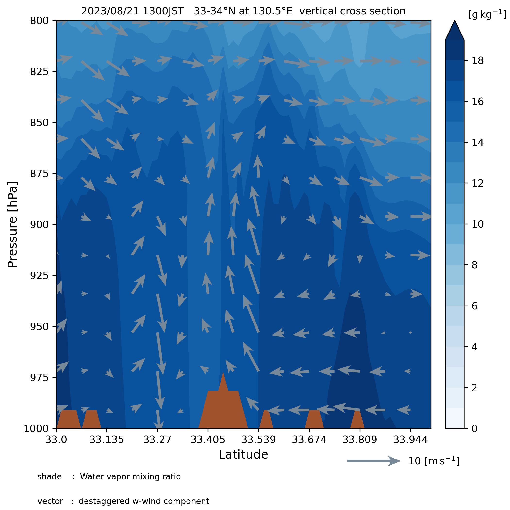

# WRF vertical drawing 
領域気象モデルWRFのシミュレーション結果の鉛直断面図を描画します。




# 仮想環境の作成とactivate
```
# via anaconda
conda env create -f requirements.yml
conda activate wrf
```

# Usage
`data/wrfout/netcdf`下にシミュレーション結果のnetcdfファイルを配置、<br>
`src/constant.py`で描画範囲等を設定します。
```
python src/main.py
```
を実行して、画像やGifを作成します。<br>
作成された画像は `img`下に出力されます。
 
# Note
- ### 変数名
   描画する変数名は、<br>
   `data/wrfout/information`下に出力されるテキストファイル及び
   [公式ドキュメント](https://wrf-python.readthedocs.io/en/latest/user_api/generated/wrf.getvar.html#wrf.getvar)を参照してください。

 
